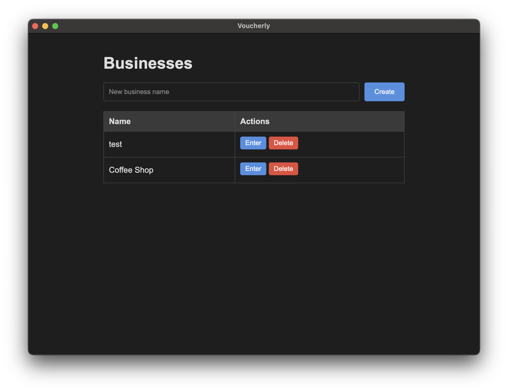
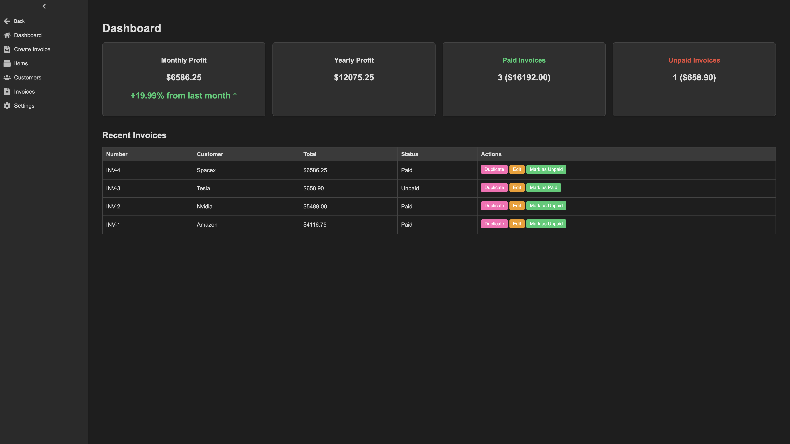
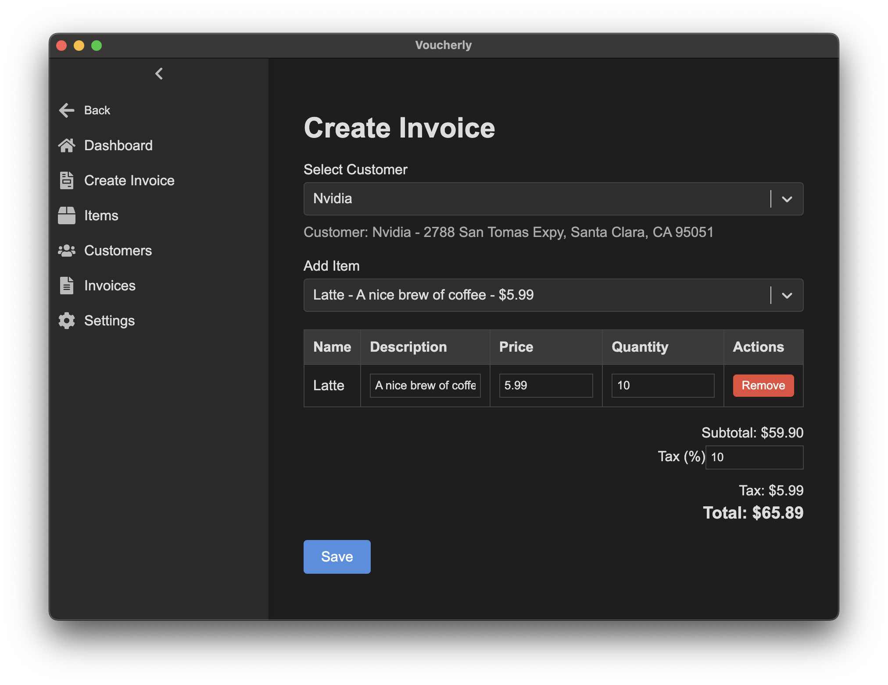
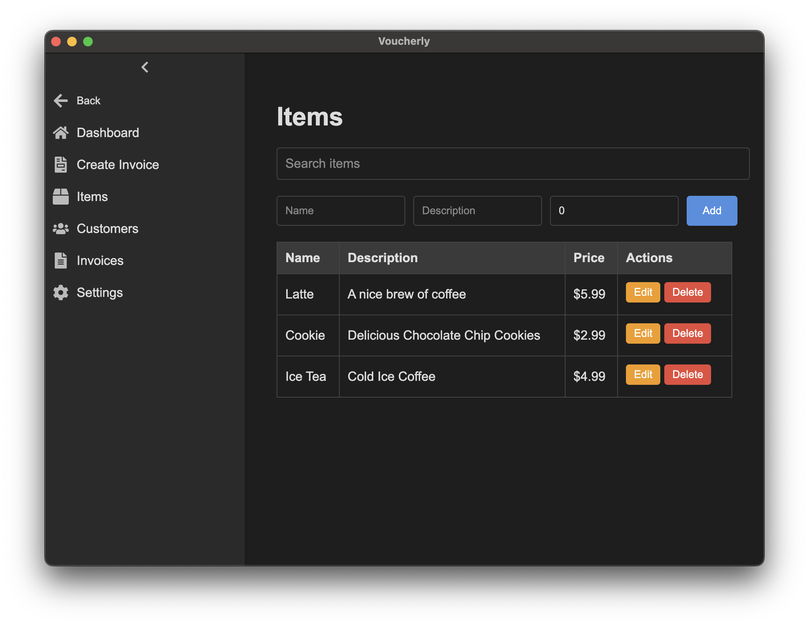
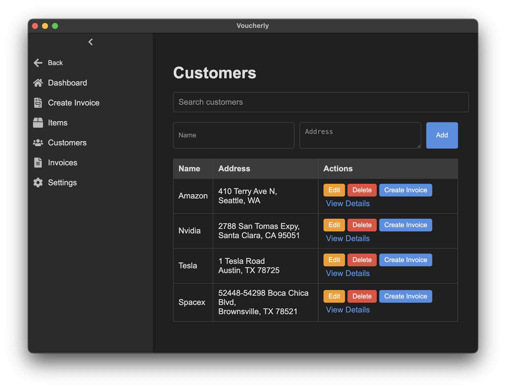
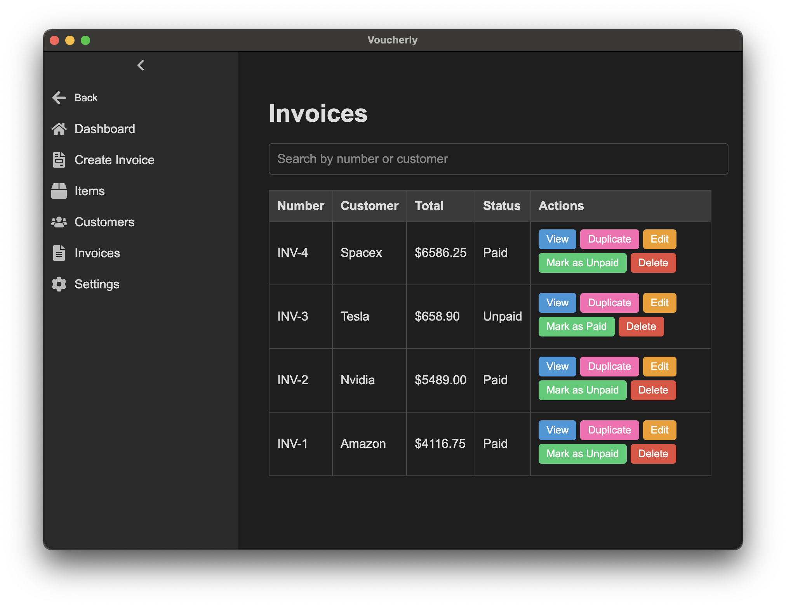
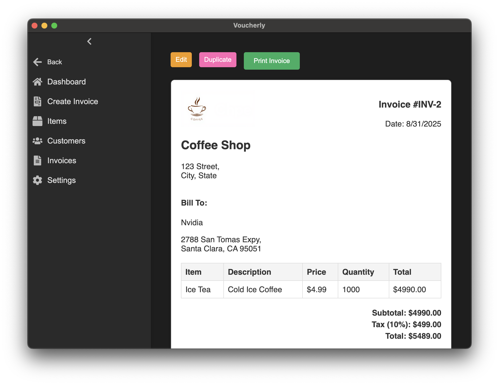

# Voucherly

## An Invoice App Made For Small Businesses By Small Businesses

<p align="center">
    
</p>

Many small businesses I have talked to are using outdated Quickbooks from the 2010s as they are not willing to pay a Subscription just to create an invoice. So Voucherly is built from the ground up with this in mind to help small businesses easily create invoices!

## Features

- **Multiple Businesses**  
  Manage more than one business with separate information, invoices, and settings.

- **Business Settings**  
  Add your business details like name, address, and logo for a professional touch.

- **Quick Items**  
  Save frequently used items so you can add them to invoices in just one click.

- **Customer Management**  
  Store customer details and quickly create invoices with auto-filled information.

- **Smart Invoicing**  
  - Create new invoices with ease.  
  - Duplicate existing invoices for recurring billing.  
  - Edit invoices anytime.  
  - Search and find invoices quickly.  

- **Tracking & Analytics**  
  - Track invoice status (paid / unpaid).  
  - See monthly and yearly profit summaries.  

## Preview

### Business Page


### Dashboard


### Create Invoice


### Items


### Customers


### Invoices


### View Invoice


## Project Setup

### Install

```bash
$ npm install
```

### Development

```bash
$ npm run dev
```

### Build

```bash
# For windows
$ npm run build:win

# For macOS
$ npm run build:mac

# For Linux
$ npm run build:linux
```
